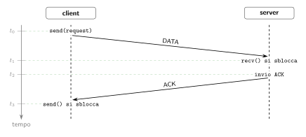

## Introduzione

I tre argomenti principali di quest'anno:

- Thread.
- Socket.
- Protocollo HTTP.

Sono strumenti indispensabili per il funzionamento di qualsiasi servizio.

## Servizio

Con servizio si intende che un operatore connesso alla rete, detto **server**, ascolta _richieste_ da operatori, detti **client**, i quali vogliono usufruire del servizio predisposto dal **server**.

La comunicazione tra _ciascun_ **client** ed il **server** è univoca, ovvero il **server** ha tante connessioni aperte contemporaneamente quanti sono i **client** di cui vuole soddisfare la **richiesta**.

## Ciclo di comunicazione HTTP

Ricapitoliamo un **ciclo di comunicazione HTTP**.

Tutto inizia dal client, il quale richiede al server di effettuare un'operazione sulla risorsa indicata dall'URL.

### Lato client

- (`c1`) Il client genera la richiesta HTTP.
- (`c2`) Il client si connette al server tramite protocollo TCP.
- (`c3`) Il client invia la richiesta e attende la risposta.
- (`c4`) Il client riceve la risposta dal server.
- (`c5`) Il client elabora la risposta.

### Lato server

- (`s1`) Il server è già in ascolto di eventuali connessioni in ingresso.
- (`s2`) Il server riceve la connessione del punto (`c2`) e la accetta.
- (`s3`) Il server riceve la richiesta inviata in (`c3`).
- (`s4`) Il server effettua i controlli su di essa (validazione, esistenza, autorizzazione).
- (`s5`) Il server elabora la richiesta producendo una risposta.
- (`s6`) Il server invia la risposta al client il quale la riceve in (`c4`).

## Il problema della concorrenza

Poniamoci questa condizione:

> Il server è single-core.

Questo significa che la CPU **non** può effettuare **due o più** operazioni contemporaneamente.

Il rapporto client-server è un rapporto **molti a uno**: più client vogliono soddisfare la propria richiesta al server. Il server però rimane sempre uno soltanto.

> Può un server single-core soddisfare più richieste contemporaneamente?

## Esempio: due client, un server

La situazione è la seguente: ci sono due client, _client-1_ e _client-2_, che vogliono effettuare una richiesta al server _server-1_.

### Connessione (accept/connect)

Il server _server-1_ è in ascolto:

```python
# server
sp = socket(AF_INET, SOCK_STREAM)
sp.bind((IP_SERVER, 443))
sp.listen()
sa = sp.accept() # bloccata
```

In quest'ultima operazione il server si blocca attendendo una connessione in ingresso.

Il client _client-1_ esegue la funzione _connect_ la quale blocca tutto fin a quando il server non accetta la connessione:

```python
# client-1
sock_client.connect((IP_SERVER, 443)) # bloccata
```

La funzione `accept` si sblocca e ritorna un socket attivo `sa` connesso a _client-1_.

```python
# server
sa = sp.accept() # si sblocca
```

Lato client, lo sblocco della funzione `accept` **equivale** allo sblocco della funzione `connect` in _client-1_:

```python
# client-1
sock_client.connect((IP_SERVER, 443)) # si sblocca
```

Quindi ora il socket `sa` nel server può scambiare pacchetti TCP con il socket `sock_client` nel client.

### Scambio dati (send/recv)

Successivamente allo sblocco della `accept` nel server e della `connect` nel client-1 entrambi si ri-bloccano in:

```python
# client-1
sock_client.connect((IP_SERVER, 443))
sock_client.send(request) # ora si blocca qui
```

```python
# server
sa = sp.accept()
request = sa.recv(BS) # ora si blocca qui
```

Quando il server riceve i dati inviati dalla `send` si sblocca. Lo sblocco del client invece avviene quando il client riceve l'`ACK` inviato dal server.




### Elaborazione della richiesta

Ora il server effettua le operazioni sulla richiesta, mentre _client-1_ non fa nulla, aspetta la risposta.


